# MERN E-Commerce Website

This project is a comprehensive e-commerce website built using the MERN stack (MongoDB, Express.js, React.js, Node.js). It provides a full-featured platform for users to browse products, add them to their cart, place orders, and make payments. The project also includes an admin panel for managing products, categories, orders, and users.

## Features

### User Features

- **User Authentication**: Users can register, log in, and manage their profiles.
- **Product Browsing**: Users can browse products, view product details, and search for products.
- **Shopping Cart**: Users can add products to their cart, update quantities, and remove items.
- **Order Management**: Users can place orders, view order details, and track order status.
- **Payment Processing**: Integration with payment gateways for secure transactions.

### Admin Features

- **Product Management**: Admins can add, update, and delete products.
- **Category Management**: Admins can manage product categories.
- **Order Management**: Admins can view and update order statuses.
- **User Management**: Admins can view and manage user accounts.

## Making Payments
The app is using Stripe as a payment method, and is running is Development Mode, which means it doesn't actually withdraw any real money but you will have to use the following card details:
```bash
Card Number: 4242 4242 4242 4242
Exp Date: ANY FUTURE DATE e.g(12/30)
CVC: ANY 3 DIGITS e.g(999)
```

## Technologies Used

### Frontend

- **React.js**: For building the user interface.
- **Redux**: For state management.
- **React Router**: For client-side routing.
- **Bootstrap 5**: For styling and responsive design.
- **SCSS**: For styling components.

### Backend

- **Node.js**: For server-side JavaScript execution.
- **Express.js**: For building the RESTful API.
- **MongoDB**: For the database to store user, product, and order information.
- **Mongoose**: For object data modeling (ODM) to interact with MongoDB.
- **JWT**: For user authentication and authorization.
- **Multer**: For handling file uploads.
- **dotenv**: For managing environment variables.
- **cors**: For enabling Cross-Origin Resource Sharing.
- **morgan**: For logging HTTP requests.
- **cookie-parser**: For parsing cookies.
- **body-parser**: For parsing incoming request bodies.

## Setup and Installation

1. **Clone the repository**:

```bash
 git clone https://github.com/harunagangx/mern-ecommerce-website.git
```

2. **Clone the repository**:

```bash
 cd mern-ecommerce-website
```

3. **Install dependencies for both frontend and backend**:

```bash
 cd backend
 npm install
 cd clients
 npm install
 cd admin
 npm install
```

4. **Add .env inside backend/config**:

```
PORT=8080
MONGO_URI=
STRIPE_API_KEY=
STRIPE_SECRET_KEY=
JWT_SECRET=
JWT_EXPIRE=
COOKIE_EXPIRE=
NODE_ENV=development
```

## Usage

1. **Start the backend server**:

```bash
cd server
npm run dev
```

2. **Start the clients development server**:

```bash
cd frontend
npm start
```

3. **Start the admin development server**:

```bash
cd admin
npm start
```

## Project Images

### Clients pages

#### Login 

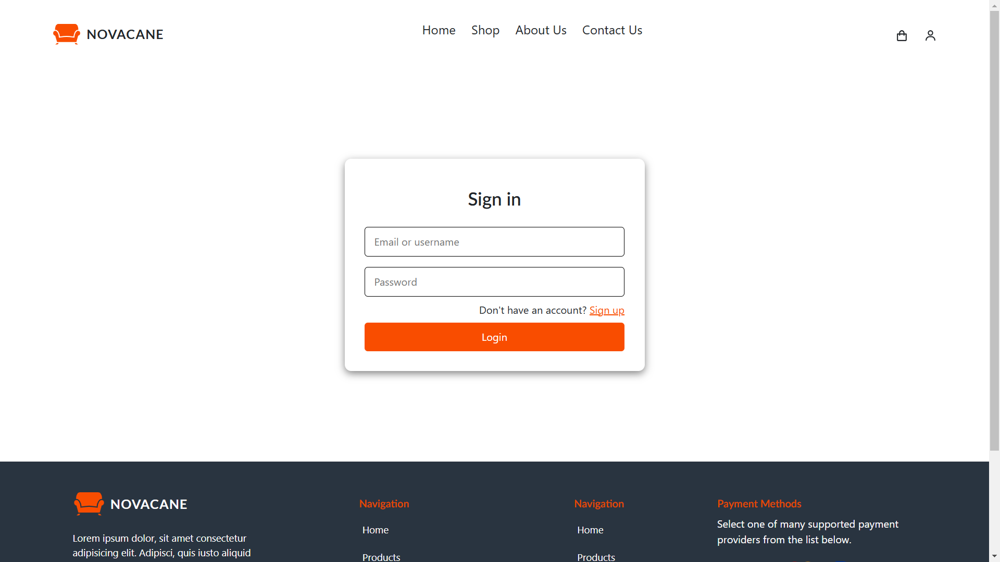

#### Home 


### Shop 

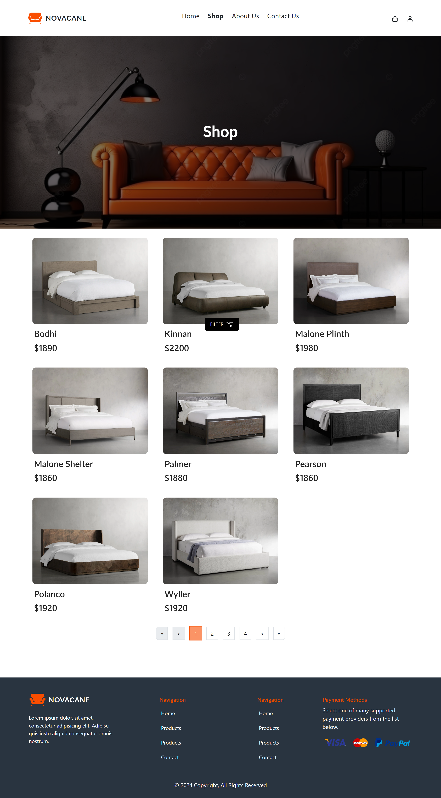

### Cart 

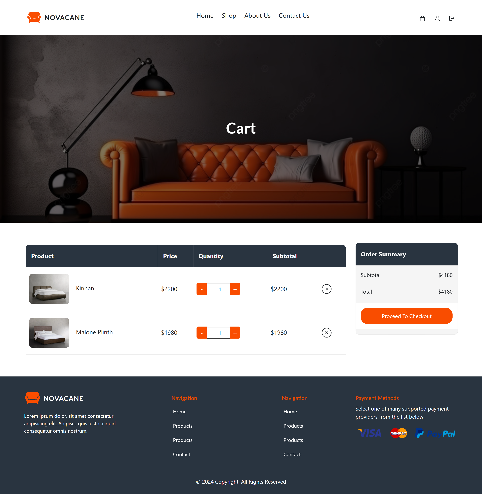

### Order shipping details

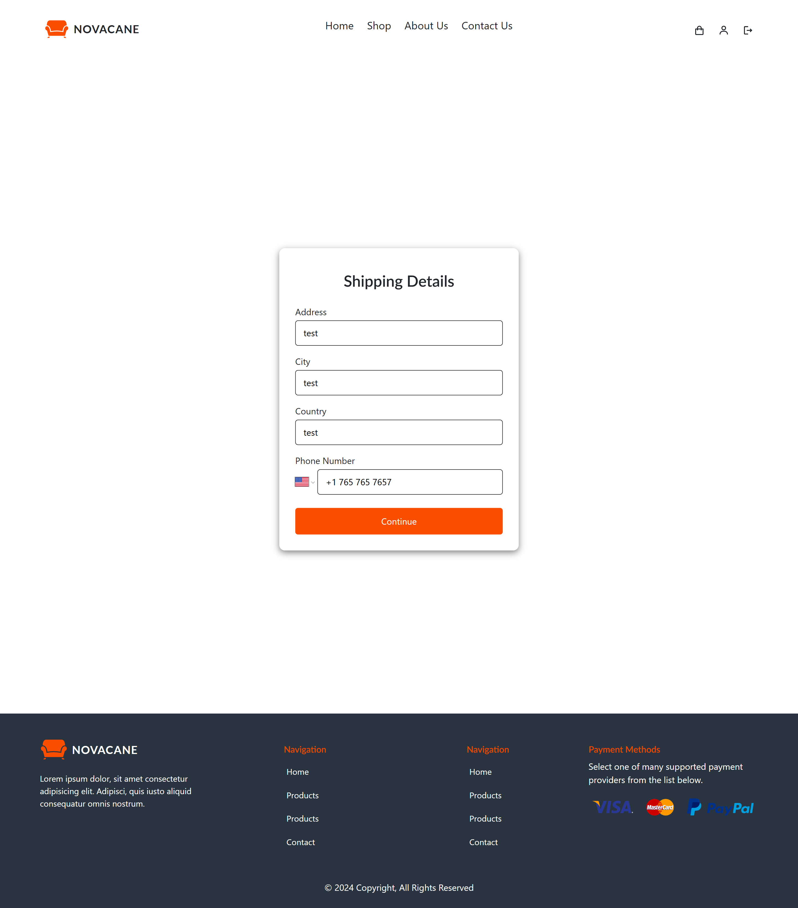

### Payment 

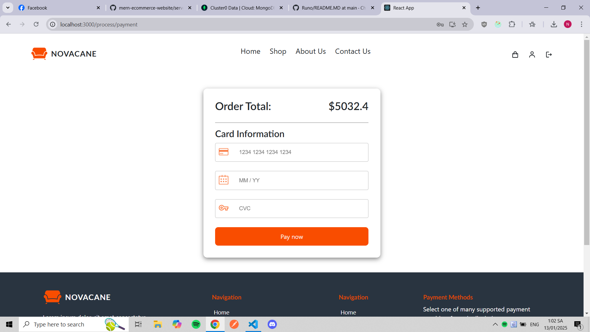

### My Orders

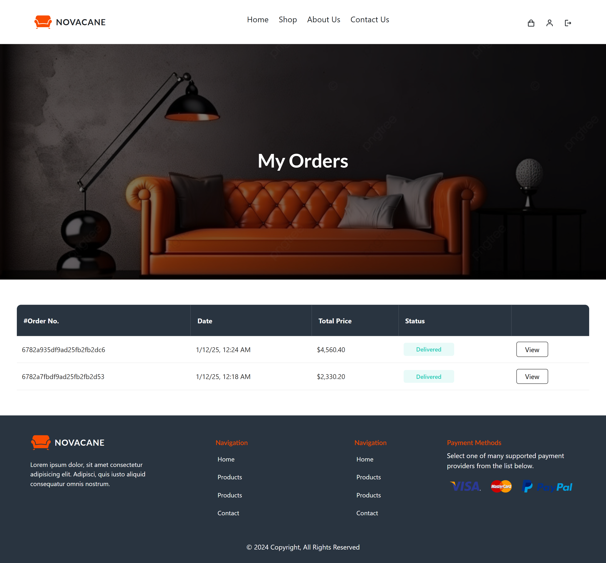

### Order Details

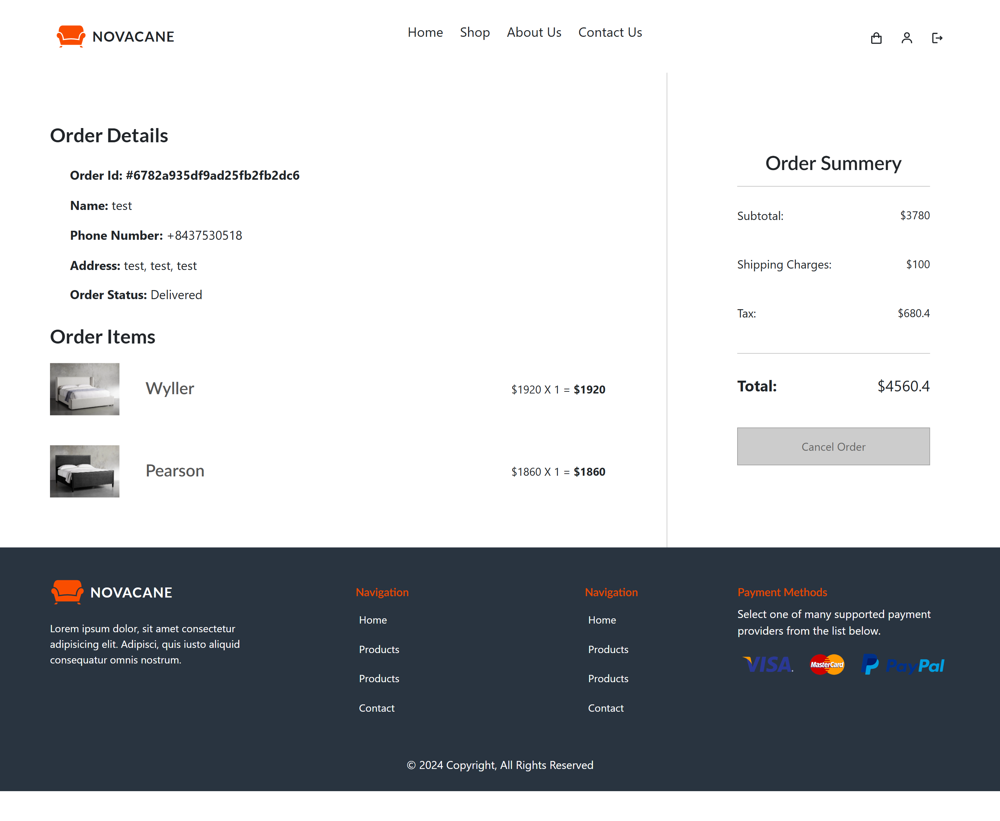

## Admin pages

### Dashboard

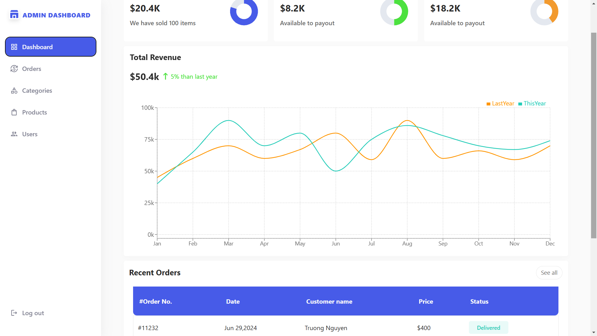

### Product Management

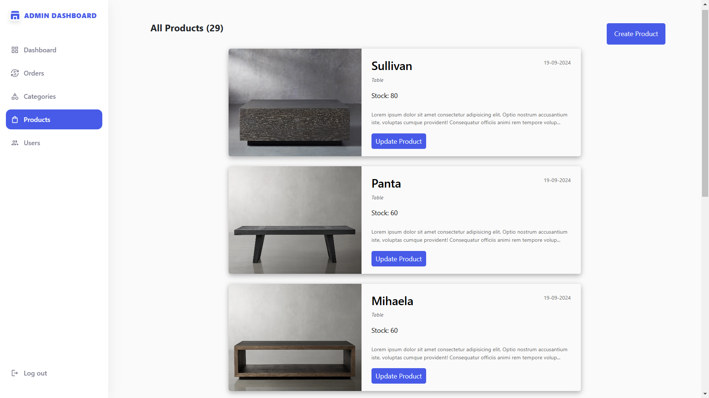

### Category Management

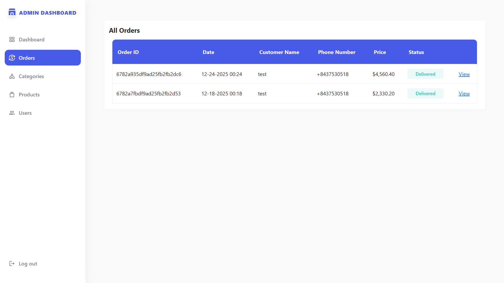


### User Management

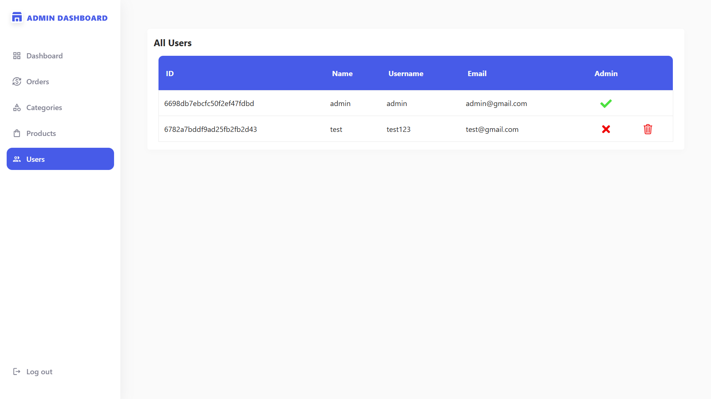


### Create Product

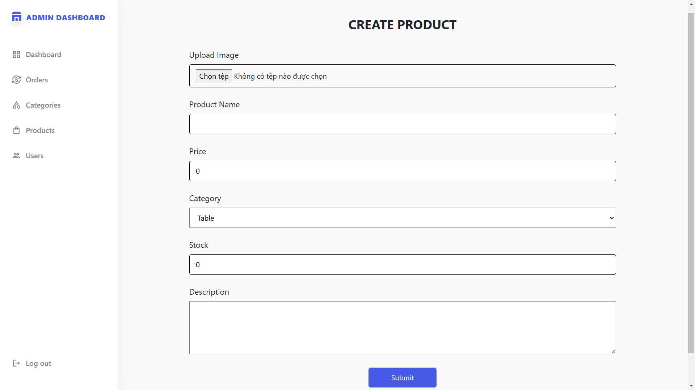


### Create Category

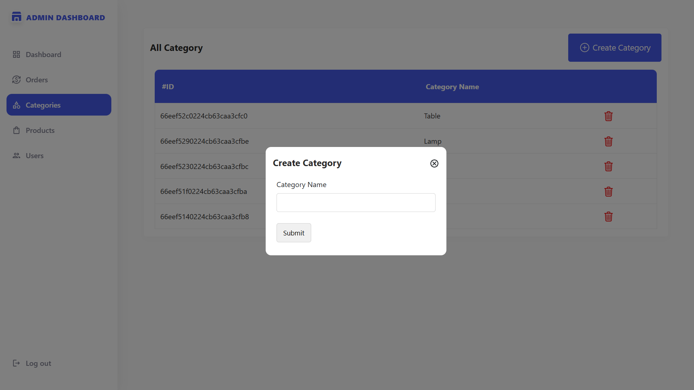

